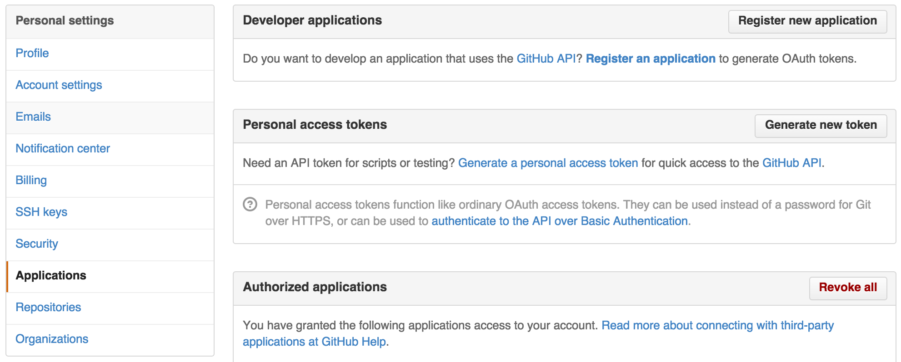
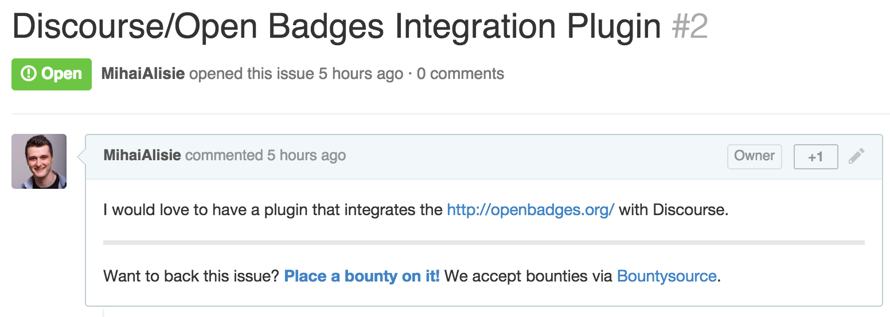

# Open collaboration system

###Ideate. Co-Create. Iterate.
> Whatever you do, or dream you can, begin it. Boldness has genius and power and magic in it.

In this guide it will be assumed that you already have a GitHub account and [Chrome on your machine][1]. If you don't have a GitHub account yet you can easily [get one here][2]. 

**In this guide you'll learn how to setup the following:**

1. [GitHub Collaboration Extension][3]
2. [Open Source Economics Engine][4]
3. *Optional [Project Focused IM][5]

------
###Step one. Supercharge GitHub workflows 

Transform your usual GitHub account into a powerful project management tool in just two steps:

**1.** Go to https://www.zenhub.io/ or directly install the Chrome extension from [the webstore](https://chrome.google.com/webstore/detail/zenhub-for-github/ogcgkffhplmphkaahpmffcafajaocjbd)

**2.** Connect your GitHub account with Zenhub. 

* You can check if everything went okay by checking [your Github application settings](https://github.com/settings/applications). You should see ZenHub as one of the authorized applications.

If ZenHub has been correctly installed, then a new tab called **"board(s)"** should appear on your GitHub repo pages. The **board(s)** are populated by the issues created, each new issue becoming a card on the new ZenHub board tab. 

This is how a populated board should look like:

Please read these articles if you want to understand more about how ZenHub works:

* [Getting started with ZenHub](https://www.zenhub.io/blog/getting-started-with-zenhub/)
* [Supercharge GitHub Workflows](https://www.zenhub.io/blog/supercharge-github-workflows-introducing-zenhub-part-i/)

TIP: **The _B_ key serves as a keyboard shortcut to display the boards in repos, while _F_ is used for quick repo switching.**

*Please note that you __need__ to install the zenhub extension in order to view and use GitHub as described in this guide.*

--------
###Step two. Accelerate open source with Bountysource

One of the biggest problems surrounding open source, community based projects is resource starvation. In our case we'll Bountysource to get around the resource starvation issue and allow the community to guide itself and become self sustainable in the process. 

1. Go to [Bountysource][6] and sign in with your GitHub account.

2. Create, contribute or solve the current issues listed in the [ethereum builders GitHub repos][7]

 
This is the screen you'll see when opening an issue on bountysource. 

Things will get more interesting once we'll have the possibility of creating DAOs but in the meantime this is a pretty cool solution as well. You're fully setup now to contribute to all the existent issues and also create new bounties.

-------

### *Step three. Enhance GitHub interactivity with Gitter.

Besides GitHub we also use an application called Gitter. Very straightforward setup process, incredibly well suited app for distributed communities and projects like this one. With this tool you're able to transform your favorite repos into your favorite chatrooms ^_^

Get started by [signing up for the free account][8] and allow it the access it needs in order to function properly. 

For those of you that don't like the permissions requested please read this:

* [Why do you ask for write access to my profile?](https://gitter.zendesk.com/hc/en-us/articles/200178961-Why-do-you-ask-for-write-access-to-my-profile-)
* [You want write access on my private repos? Are you insane?](https://gitter.zendesk.com/hc/en-us/articles/200178971-You-want-write-access-on-my-private-repos-Are-you-insane-)

#Highfive! You're all set!

  [1]: https://github.com/ethereumbuilders
  [2]: https://github.com/join
  [3]: https://chrome.google.com/webstore/detail/zenhub-for-github/ogcgkffhplmphkaahpmffcafajaocjbd
  [4]: https://www.bountysource.com/
  [5]: https://gitter.im/
  [6]: https://www.bountysource.com/signin
  [7]: https://github.com/ethereumbuilders
  [8]: https://gitter.im/login/github?action=signup&source=intro-signup
